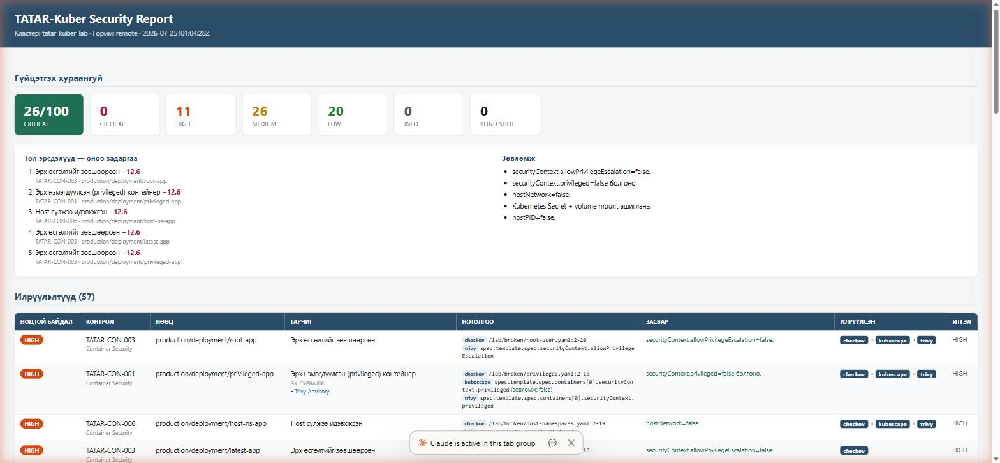

# TATAR-Kuber Lab

Reproducible **vulnerable** and **hardened** Kubernetes manifests — the official test,
demo and regression corpus for the [**TATAR-Kuber**](https://github.com/ochmunkh/tatar-kuber)
security engine.

**Author:** Enkhbat.O — Security Analyst

> Two repositories, one product:
> - **[tatar-kuber](https://github.com/ochmunkh/tatar-kuber)** — the engine (scanner
>   orchestration, canonical mapping, dedup, risk, reports).
> - **tatar-kuber-lab** (this repo) — the manifests + expected results that prove it works.

Running the lab through TATAR-Kuber (English / Монгол):

| English | Монгол |
|---|---|
|  |  |

## Pipeline this repo demonstrates

```
raw/                          normalized/                report
 ├─ checkov.json      ─┐       tatar-findings.json  ─►    report.html
 ├─ trivy.json        ─┤ ─►  (canonical + dedup +          (JSON / SARIF / HTML)
 ├─ kubescape.json    ─┤       risk + blind-shot)
 └─ popeye.json       ─┘             │
   (raw scanner output)              └─►  expected/expected-findings.json  (verify-lab)
```

- `broken/` — intentionally violates security controls
- `fixed/` — hardened equivalents (should produce no container findings)
- `raw/` — real/representative scanner output so you can run **offline** (no cluster, no install)
- `normalized/tatar-findings.json` — the unified TATAR output (raw → normalized)
- `expected/expected-findings.json` — regression baseline for `tatar-kuber verify-lab`

## 30-second demo (offline)

```bash
go install github.com/ochmunkh/tatar-kuber/cmd/tatar-kuber@latest
git clone https://github.com/ochmunkh/tatar-kuber-lab && cd tatar-kuber-lab
git clone https://github.com/ochmunkh/tatar-kuber ../engine   # for the canonical registry

tatar-kuber scan   --raw-dir raw --registry ../engine/schema/canonical-controls.yaml -o normalized
mv normalized/scan-result.json normalized/tatar-findings.json
tatar-kuber report --input normalized/tatar-findings.json -o html --out normalized/report.html
tatar-kuber verify-lab --input normalized/tatar-findings.json --expected expected/expected-findings.json
# Монголоор:  tatar-kuber scan ... --lang mn
```

Expected:

```
verify-lab: offline multi-scanner (broken/): checkov + trivy + kubescape + popeye
  controls: expected 16, missing 0
  findings: actual 57
  CRITICAL  expected 0,  actual 0   [ok]
  HIGH      expected 11, actual 11  [ok]
  MEDIUM    expected 26, actual 26  [ok]
  LOW       expected 20, actual 20  [ok]
RESULT: PASS
```

## Full run (real scanners, local — no cluster)

Checkov and Trivy scan **manifest files** directly:

```bash
checkov -d broken --framework kubernetes -o json > raw/checkov.json
trivy   config broken --format json               > raw/trivy.json
./run-lab.sh          # regenerates + verifies
```

Popeye is runtime-only (needs a live cluster) — `raw/popeye.json` here is a representative sample.

## Live cluster (Kind)

```bash
kind create cluster && kubectl create namespace production
kubectl apply -f broken/
# collect scanner output → tatar-kuber scan
```

## Broken → expected canonical controls (16)

| File | Expected TATAR controls | Detected by |
|---|---|---|
| `privileged.yaml` | CON-001, NET-001 | Trivy · Kubescape · Checkov |
| `root-user.yaml` | CON-002, CON-003 | Checkov · Trivy · Kubescape |
| `latest-tag.yaml` | IMG-003, CON-010, OPS-001/002/005 | Checkov · Trivy · Popeye |
| `wildcard-rbac.yaml` | RBAC-002 | Checkov · Kubescape |
| `secret-env.yaml` | SEC-001 | **Trivy secret** (Checkov misses plaintext) |
| `host-namespaces.yaml` | CON-005, CON-006 | Checkov · Trivy · Kubescape |
| _(hardening gaps)_ | CON-009, CON-011, SEC-003 | Checkov |

Multi-scanner wins: `SEC-001` (Trivy secret) and `NET-001` (Kubescape) are **missed by
Checkov alone** — the unified TATAR view catches them. `CON-001` privileged is found by
**all three static scanners** → `found_by=[checkov,kubescape,trivy]`, `confidence=HIGH`.

## Why this lab

1. **Demo** — clone, scan, done in a minute (no cluster).
2. **Regression** — `verify-lab` fails loudly if a release drops an expected control or
   changes counts (e.g. dedup regression: 16 controls → 8).
3. **CI** — `.github/workflows/lab.yml` builds the engine and verifies on every push.
4. **Benchmark** — a shared, honest corpus to compare Trivy vs Kubescape vs Checkov vs
   the unified TATAR view.

## Notes

`raw/checkov.json` is **real Checkov 3.3.8** output. `trivy.json` / `kubescape.json` /
`popeye.json` are representative samples matching the manifests — regenerate with the real
tools for exact parity. Scanner rule IDs are PROVISIONAL; this lab keeps them honest.

## License

Apache-2.0

---

## Монгол хэл дээр

[**TATAR-Kuber**](https://github.com/ochmunkh/tatar-kuber) engine-ийг турших, demo хийх,
regression шалгах зориулалттай **эмзэг** ба **hardened** Kubernetes manifest-ийн цуглуулга.

- `broken/` — аюулгүй байдлын control-уудыг зориудаар зөрчсөн
- `fixed/` — hardening зөв хийсэн хувилбарууд
- `raw/` — бодит/төлөөлөх scanner гаралт (checkov бодит; trivy/kubescape/popeye жишээ) —
  cluster эсвэл суулгацгүйгээр **offline** ажиллуулах боломжтой
- `normalized/tatar-findings.json` — TATAR-ийн нэгтгэсэн гаралт (raw → normalized)
- `expected/expected-findings.json` — `tatar-kuber verify-lab`-ийн regression baseline

### 30 секундийн demo (offline)

```bash
go install github.com/ochmunkh/tatar-kuber/cmd/tatar-kuber@latest
git clone https://github.com/ochmunkh/tatar-kuber-lab && cd tatar-kuber-lab
git clone https://github.com/ochmunkh/tatar-kuber ../engine

tatar-kuber scan   --raw-dir raw --lang mn --registry ../engine/schema/canonical-controls.yaml -o normalized
mv normalized/scan-result.json normalized/tatar-findings.json
tatar-kuber report --input normalized/tatar-findings.json -o html --out normalized/report.html
tatar-kuber verify-lab --input normalized/tatar-findings.json --expected expected/expected-findings.json
```

### Яагаад хэрэгтэй вэ

1. **Demo** — clone хийгээд, scan хийж, нэг минутад дуусна (cluster хэрэггүй).
2. **Regression** — `verify-lab` нь хүлээгдсэн control алга болох, эсвэл тоо өөрчлөгдвөл
   шууд FAIL болно (ж: dedup эвдэрч 16 control → 8).
3. **CI** — push бүрт engine-ийг build хийж баталгаажуулна.
4. **Benchmark** — Trivy vs Kubescape vs Checkov vs нэгтгэсэн TATAR-ийг харьцуулах нийтлэг суурь.

**Зохиогч:** Enkhbat.O — Security Analyst
