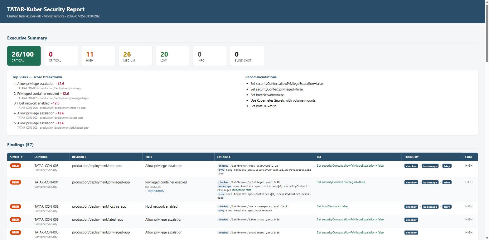
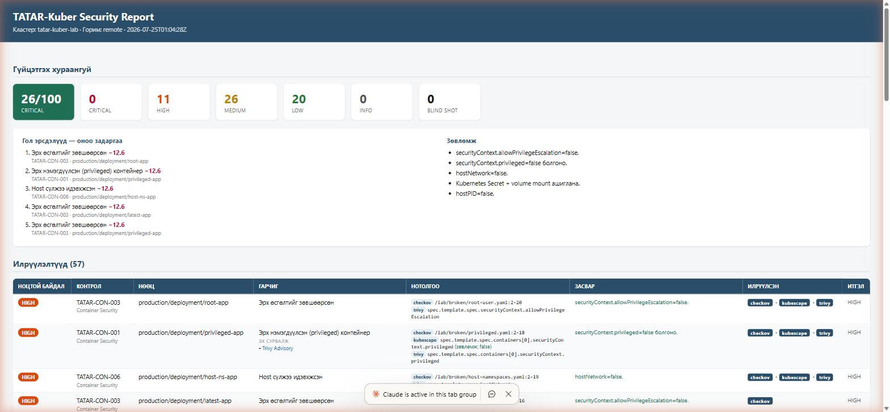

# TATAR-Kuber Lab


<!-- counts:badge --><!-- /counts:badge -->

[](https://github.com/ochmunkh/Tatar-Kuber-Lab/actions/workflows/lab.yml)

Reproducible **vulnerable** and **hardened** Kubernetes manifests — the official test,
demo and regression corpus for the [**TATAR-Kuber**](https://github.com/ochmunkh/tatar-kuber)
security engine.

**Author:** Enkhbat.O — Security Analyst

> Two repositories, one product:
> - **[tatar-kuber](https://github.com/ochmunkh/tatar-kuber)** — the engine (scanner
>   orchestration, canonical mapping, dedup, risk, MITRE ATT&CK, reports).
> - **tatar-kuber-lab** (this repo) — the manifests + expected results that prove it works.
>
> The engine also ships a tiny `examples/demo` (a **different**, self-contained dataset for its
> own CI/Pages, story: privileged on `deployment/api`). This lab is the **full** corpus +
> `verify-lab` regression baseline — not a duplicate, a different scope.

Running the lab through TATAR-Kuber:

**🇬🇧 English report**



**🇲🇳 Монгол тайлан**



## Pipeline this repo demonstrates

```
raw/                          .lab-out/                  normalized/
 ├─ checkov.json      ─┐       scan-result.json  ────►     report.html
 ├─ trivy.json        ─┤ ─►  (canonical + dedup +          report.json · tatar.sarif
 ├─ kubescape.json    ─┤       risk + blind-shot)
 └─ popeye.json       ─┘             │
   (raw scanner output)              ├─►  expected/expected-findings.json  (verify-lab)
                                     └─►  normalized/tatar-findings.json   (per-finding diff)
```

- `broken/` — intentionally violates security controls
- `fixed/` — hardened equivalents. **Measured**, not assumed: the pinned Checkov 3.3.8 run over
  `fixed/` (committed as `raw-fixed/checkov.json`) reports **zero** failed checks, so `fixed/`
  produces zero canonical findings. `run-lab.sh` holds that claim up from two sides: step 6 feeds
  the committed output back through the engine and fails on any finding, and step 0 fails when
  `fixed/` no longer matches the fingerprint stamped into `raw-fixed/versions.json` — the case
  where the manifests moved but the measurement did not. What it does **not** do is re-run
  Checkov: the zero is re-*measured* by `./scripts/regen-raw.sh fixed`, which is exactly what a
  failing step 0 tells you to run
- `raw/` — real/representative scanner output so you can run **offline** (no cluster, no install)
- `raw-fixed/` — real Checkov 3.3.8 output for `fixed/`, so the claim above is checkable
- `raw/versions.json`, `raw-fixed/versions.json` — the scanner version pins **and**
  `corpus_sha256`, one sha256 over the corpus that output was generated from
  (`./scripts/corpus-fp.sh`). Step 0 checks both pairs, so neither `raw/`↔`broken/` nor
  `raw-fixed/`↔`fixed/` can go stale in silence
- `normalized/tatar-findings.json` — the committed **per-finding baseline** (the unified TATAR
  output, raw → normalized). `run-lab.sh` diffs every run against it and fails on drift
- `expected/expected-findings.json` — count/control baseline for `tatar-kuber verify-lab`, and
  the one place the engine pin (`"engine": ">=1.0.3"`) lives
- `expected/expected-fixed.json` — the same, for the hardened corpus

## 30-second demo (offline)

The canonical registry is **embedded in the binary** — no engine checkout needed.

```bash
go install github.com/ochmunkh/tatar-kuber/cmd/tatar-kuber@latest
git clone https://github.com/ochmunkh/tatar-kuber-lab && cd tatar-kuber-lab
./run-lab.sh            # or: ./run-lab.sh mn   for a Mongolian report
```

`run-lab.sh` exercises the **full** feature set against this corpus and **self-checks** — it
exits non-zero on any drift, so it is a test, not output to eyeball:
engine pin **+ corpus fingerprints** → `doctor` → `scan` (canonical + dedup + confidence + risk +
**MITRE ATT&CK**) → `report` (HTML · SARIF · JSON) → `gate` (policy
[`.tatar-kuber.yaml`](.tatar-kuber.yaml), which **must block** this corpus — a gate that *passed*
here fails the lab) → `verify-lab` (`broken/` **and** `fixed/`) → per-finding diff against
`normalized/tatar-findings.json` → README/policy count check.

It writes nothing tracked — the scan lands in `.lab-out/` and the reports in `normalized/`
(both gitignored), so `git status` stays clean after a run. `tatar-kuber` is the only
requirement: `jq` is a fast path, not a dependency. Without it the run still does every check
but the README counts (step 8), compares the baseline line by line instead of as canonical JSON,
and ends with a `[lab] DEGRADED` summary naming exactly what it gave up.

Expected:

<!-- counts:verify-lab -->
```
verify-lab: offline multi-scanner (broken/): checkov + trivy + kubescape + popeye
  controls: expected 20, missing 0
  findings: actual 69
  CRITICAL expected 1, actual 1  [ok]
  HIGH     expected 16, actual 16  [ok]
  MEDIUM   expected 33, actual 33  [ok]
  LOW      expected 19, actual 19  [ok]
  INFO     expected 0, actual 0  [ok]
RESULT: PASS
```
<!-- /counts:verify-lab -->

## Full run (real scanners, local — no cluster)

Checkov and Trivy scan **manifest files** directly. **Pin the versions**: `expected/` encodes
exact integers over one ruleset, so an unpinned `pip install checkov` quietly turns this into a
baseline for an undocumented scanner version.

```bash
pip install 'checkov==3.3.8'                       # must match raw/versions.json
checkov -d broken --framework kubernetes -o json > raw/checkov.json
docker run --rm -v "$PWD:/w" -w /w aquasec/trivy:0.53.0 \
  config broken --format json                    > raw/trivy.json
./run-lab.sh          # VERIFIES only — it never regenerates raw/
```

Heads-up: that hand-rolled `checkov` line writes the tool's **untrimmed** output, which fills in
the guideline URLs the committed `raw/checkov.json` carries as `null`. `verify-lab` still passes
(measured: the same 107 failed checks → 69 findings / 20 controls), but step 7 then reports a
large, **count-neutral** baseline diff — 59 `references` lines plus 2 `raw_bytes` — so re-run with
`--update-baseline` and say so in the commit. A hand-rolled `trivy` line is the same story. The
script below is the path that preserves the committed house style.

Or let the script keep the pin honest for you:

```bash
./scripts/regen-raw.sh            # raw/ from broken/, raw-fixed/ from fixed/
```

`regen-raw.sh` runs the pinned Checkov (locally when the installed version matches the pin,
otherwise via the `bridgecrew/checkov:3.3.8` image), writes `versions.json` from the tool's own
`--version` instead of by hand — including the `corpus_sha256` that step 0 checks — and
**refuses** to overwrite a corpus when it cannot honour the pin — `ALLOW_VERSION_BUMP=1` makes a bump a deliberate commit next to the new `expected/` counts.

Popeye is runtime-only (needs a live cluster) — `raw/popeye.json` here is a representative sample.

## Live cluster (Kind)

```bash
kind create cluster && kubectl create namespace production
kubectl apply -f broken/
# collect scanner output → tatar-kuber scan
```

## Broken → expected canonical controls <!-- counts:controls-en -->(20)<!-- /counts:controls-en -->

| File | Expected TATAR controls | Detected by |
|---|---|---|
| `privileged.yaml` | CON-001, NET-001 | Trivy · Kubescape · Checkov |
| `root-user.yaml` | CON-002, CON-003 | Checkov · Trivy · Kubescape |
| `latest-tag.yaml` | IMG-003, CON-010, OPS-001/002/005 | Checkov · Trivy · Popeye |
| `wildcard-rbac.yaml` | RBAC-001, RBAC-002, RBAC-003 | Checkov · Kubescape |
| `secret-env.yaml` | SEC-001 | **Trivy secret** (Checkov misses plaintext) |
| `host-namespaces.yaml` | CON-005, CON-006 | Checkov · Trivy · Kubescape |
| _(hardening gaps)_ | CON-004, CON-008, CON-009, CON-011, SEC-003 | Checkov |

Multi-scanner wins: `SEC-001` (Trivy secret) and `RBAC-001` (Kubescape — the corpus's only
CRITICAL) are **missed by Checkov alone** — the unified TATAR view catches them. `CON-001`
privileged is found by **all three static scanners** → `found_by=[checkov,kubescape,trivy]`,
`confidence=HIGH`. (`NET-001` is *not* an example of this: Checkov's `CKV2_K8S_6` fires on it
five times in `raw/checkov.json`, so Checkov alone does catch it.)

`wildcard-rbac.yaml` also shows why mapping precision matters: Checkov's `CKV_K8S_49`
(wildcard verbs) and Kubescape's `C-0272` (administrative roles) are **different findings on the
same ClusterRole** — RBAC-002 (HIGH) and RBAC-001 (CRITICAL). Until the v1.0.2 mapping audit,
`C-0272` was mis-mapped onto "wildcard permissions" and the two collapsed into one.

> `raw/popeye.json` deliberately uses Popeye's **legacy `sanitizers` schema** (<= 0.21, matching
> `raw/versions.json`). Popeye 0.22 renamed it to `sections`; keeping the old shape here proves
> tatar-kuber still reads both.

## Why this lab

1. **Demo** — clone, scan, done in a minute (no cluster).
2. **Regression** — `verify-lab` fails loudly if a release drops an expected control or
   changes counts (e.g. dedup regression: <!-- counts:regression-en -->20 controls → 8<!-- /counts:regression-en -->),
   and the per-finding diff against `normalized/tatar-findings.json` also catches a changed
   resource, title, `found_by` or MITRE technique at identical counts.
3. **CI** — `.github/workflows/lab.yml` builds the engine and verifies on every push, plus a
   weekly cron so an engine-side change cannot sit undetected until the next unrelated push.
4. **Benchmark** — a shared, honest corpus to compare Trivy vs Kubescape vs Checkov vs
   the unified TATAR view.

## Notes

`raw/checkov.json` and `raw-fixed/checkov.json` are **real Checkov 3.3.8** output, and the
`broken/` one is reproducible: `./scripts/regen-raw.sh broken` with Checkov 3.3.8 yields the same
107 failed checks and the same `result_hash` (it additionally fills in the guideline URLs the
committed copy carries as `null`). `trivy.json` / `kubescape.json` / `popeye.json` are
representative samples matching the manifests — regenerate with the real tools for exact parity.
Scanner rule IDs are PROVISIONAL; this lab keeps them honest.

This baseline is valid for **TATAR-Kuber >= 1.0.3**. The pin lives in one place —
`expected/expected-findings.json` (`"engine"`) — and `run-lab.sh` checks it *before* it asks you
to believe a count mismatch, so "my engine is old" and "the lab is wrong" stop looking the same.

## License

Apache-2.0

---

## Монгол хэл дээр

[**TATAR-Kuber**](https://github.com/ochmunkh/tatar-kuber) engine-ийг турших, demo хийх,
regression шалгах зориулалттай **эмзэг** ба **hardened** Kubernetes manifest-ийн цуглуулга.

### Энэ repo-гийн харуулдаг pipeline

```
raw/                          .lab-out/                  normalized/
 ├─ checkov.json      ─┐       scan-result.json  ────►     report.html
 ├─ trivy.json        ─┤ ─►  (canonical + dedup +          report.json · tatar.sarif
 ├─ kubescape.json    ─┤       risk + blind-shot)
 └─ popeye.json       ─┘             │
   (түүхий scanner гаралт)           ├─►  expected/expected-findings.json  (verify-lab)
                                     └─►  normalized/tatar-findings.json   (finding тус бүрийн diff)
```

- `broken/` — аюулгүй байдлын control-уудыг зориудаар зөрчсөн
- `fixed/` — hardening зөв хийсэн хувилбарууд. ТААМАГЛААГҮЙ, **хэмжсэн**: `fixed/` дээрх pin-тэй
  Checkov 3.3.8-ын гаралт (`raw-fixed/checkov.json` болгож commit хийсэн) ямар ч failed check
  гаргаагүй тул `fixed/` нь canonical finding үүсгэхгүй. `run-lab.sh` үүнийг ХОЁР талаас барина:
  6-р шат нь commit хийсэн гаралтыг engine-ээр дахин нормчилж, ямар нэг finding гарвал унана;
  0-р шат нь `fixed/`-ийн fingerprint `raw-fixed/versions.json`-д бичигдсэнээс зөрвөл унана —
  өөрөөр хэлбэл manifest хөдөлсөн ч хэмжилт хөдлөөгүй тохиолдлыг барина. Харин Checkov-ыг
  ДАХИН АЖИЛЛУУЛДАГГҮЙ: тэгийг дахин **хэмжих** нь `./scripts/regen-raw.sh fixed` бөгөөд 0-р шат
  унахдаа яг үүнийг хийхийг шаардана
- `raw/` — бодит/төлөөлөх scanner гаралт (checkov бодит; trivy/kubescape/popeye жишээ) —
  cluster эсвэл суулгацгүйгээр **offline** ажиллуулах боломжтой
- `raw-fixed/` — `fixed/` дээрх бодит Checkov 3.3.8 гаралт, дээрх мэдэгдлийг шалгах боломжтой болгоно
- `raw/versions.json`, `raw-fixed/versions.json` — scanner-ийн хувилбарын pin (checkov 3.3.8,
  trivy 0.53.0, kubescape 3.0.8, popeye 0.21.5) **ба** `corpus_sha256` — тухайн гаралтыг үүсгэсэн
  corpus дээрх нэг sha256 (`./scripts/corpus-fp.sh`). Pin-ээ баримталж бодит Checkov гаралтыг
  дахин үүсгэх нь `./scripts/regen-raw.sh` (fingerprint-ийг бас бичнэ). 0-р шат хоёр хосыг
  шалгадаг тул `raw/`↔`broken/`, `raw-fixed/`↔`fixed/` хоёулаа чимээгүйхэн хоцрох боломжгүй
- `normalized/tatar-findings.json` — commit хийсэн **finding тус бүрийн baseline** (TATAR-ийн
  нэгтгэсэн гаралт, raw → normalized). `run-lab.sh` ажиллалт бүрийг үүнтэй тулгаж, зөрвөл FAIL болно
- `expected/expected-findings.json` — `tatar-kuber verify-lab`-ийн тоо/control-ийн baseline, мөн
  engine-ийн pin (`"engine": ">=1.0.3"`) зөвхөн энд байна
- `expected/expected-fixed.json` — hardened corpus-ийн ижил baseline

### 30 секундийн demo (offline)

Canonical registry нь binary дотор **шигтгэсэн** тул engine-ийг clone хийх шаардлагагүй.

```bash
go install github.com/ochmunkh/tatar-kuber/cmd/tatar-kuber@latest
git clone https://github.com/ochmunkh/tatar-kuber-lab && cd tatar-kuber-lab
./run-lab.sh mn         # монгол тайлан
```

`run-lab.sh` нь энэ corpus дээр **бүх** боломжийг ажиллуулж, өөрөө **шалгана** — ямар ч зөрөө
гарвал non-zero кодоор унана, өөрөөр хэлбэл хүний нүдээр харах гаралт биш, тест юм:
engine-ийн pin **+ corpus-ийн fingerprint** → `doctor` → `scan` (canonical + dedup + confidence +
risk + **MITRE ATT&CK**) → `report` (HTML · SARIF · JSON) → `gate` (бодлого
[`.tatar-kuber.yaml`](.tatar-kuber.yaml) — энэ corpus-ыг **ЗААВАЛ хорих** ёстой; gate нь *passed*
болвол lab унана) → `verify-lab` (`broken/` **ба** `fixed/`) → `normalized/tatar-findings.json`-той
finding тус бүрийн diff → README/бодлогын тоонуудын шалгалт.

Git-д хяналттай ямар ч файлыг бичихгүй: scan нь `.lab-out/`, тайлан нь `normalized/` (хоёул
gitignore-д) руу бичигддэг тул ажиллуулсны дараа `git status` цэвэр хэвээр. Зөвхөн `tatar-kuber`
шаардлагатай: `jq` нь хурдан зам, харин шаардлага биш. `jq` байхгүй бол README-гийн тоонуудын
шалгалт (8-р шат) л алгасагдана, baseline-ыг canonical JSON биш мөр мөрөөр тулгана, мөн ажиллалт
`[lab] DEGRADED` хэсгээр юуг алгассанаа яг нэрлэж дуусна.

### Бүтэн ажиллалт (бодит scanner, локал — cluster хэрэггүй)

Checkov ба Trivy нь **manifest файлыг** шууд шалгана. **Хувилбаруудыг заавал пиннэнэ**:
`expected/` нь нэг ruleset дээрх яг тодорхой бүхэл тоонуудыг агуулдаг тул пиннээгүй
`pip install checkov` нь үүнийг баримтжуулаагүй scanner хувилбарын baseline болгож чимээгүйхэн
хувиргана.

```bash
pip install 'checkov==3.3.8'                       # raw/versions.json-той таарах ёстой
checkov -d broken --framework kubernetes -o json > raw/checkov.json
docker run --rm -v "$PWD:/w" -w /w aquasec/trivy:0.53.0 \
  config broken --format json                    > raw/trivy.json
./run-lab.sh          # ЗӨВХӨН шалгана — raw/-г хэзээ ч дахин үүсгэхгүй
```

Анхаарах зүйл: дээрх гараар бичсэн `checkov` мөр нь хэрэгслийн **тайраагүй** гаралтыг бичнэ —
commit хийсэн `raw/checkov.json` дотор `null` байдаг guideline URL-уудыг дүүргэнэ гэсэн үг.
`verify-lab` тэр чигээрээ давна (хэмжсэн: ижил 107 failed check → 69 finding / 20 control),
харин 7-р шат нь **тоонд нөлөөлөхгүй** том baseline diff мэдээлнэ — 59 `references` мөр дээр
2 `raw_bytes`. Тиймээс `--update-baseline`-тай дахин ажиллуулж, commit дотроо дурдана. Гараар
бичсэн `trivy` мөр ч мөн адил. Доорх script нь commit хийсэн хэв маягийг хадгалдаг зам юм.

Эсвэл pin-ийг script-ээр шударга байлгаж болно:

```bash
./scripts/regen-raw.sh            # broken/-оос raw/, fixed/-ээс raw-fixed/
```

`regen-raw.sh` нь пиннэсэн Checkov-ыг ажиллуулж (суусан хувилбар pin-тэй таарвал локалаар,
эс бөгөөс `bridgecrew/checkov:3.3.8` image-ээр), `versions.json`-ыг гараар биш, хэрэгслийн
өөрийнх нь `--version`-оос бичнэ — 0-р шатны шалгадаг `corpus_sha256`-ыг оруулаад. Pin-ээ барьж
чадахгүй бол corpus-ыг дарж бичихээс **татгалзана** — `ALLOW_VERSION_BUMP=1` нь хувилбарын
үсрэлтийг шинэ `expected/` тоонуудын хажууд зориудаар хийсэн commit болгоно.

Popeye нь зөвхөн runtime-д ажилладаг (амьд cluster шаардана) — энд байгаа `raw/popeye.json` нь
төлөөлөх жишээ.

### Амьд cluster (Kind)

```bash
kind create cluster && kubectl create namespace production
kubectl apply -f broken/
# scanner-ийн гаралтыг цуглуулаад → tatar-kuber scan
```

### Эмзэг manifest → хүлээгдэх canonical control <!-- counts:controls-mn -->(20)<!-- /counts:controls-mn -->

| Файл | Хүлээгдэх TATAR control | Илрүүлэгч |
|---|---|---|
| `privileged.yaml` | CON-001, NET-001 | Trivy · Kubescape · Checkov |
| `root-user.yaml` | CON-002, CON-003 | Checkov · Trivy · Kubescape |
| `latest-tag.yaml` | IMG-003, CON-010, OPS-001/002/005 | Checkov · Trivy · Popeye |
| `wildcard-rbac.yaml` | RBAC-001, RBAC-002, RBAC-003 | Checkov · Kubescape |
| `secret-env.yaml` | SEC-001 | **Trivy secret** (Checkov plaintext-ыг барихгүй) |
| `host-namespaces.yaml` | CON-005, CON-006 | Checkov · Trivy · Kubescape |
| _(hardening дутуу)_ | CON-004, CON-008, CON-009, CON-011, SEC-003 | Checkov |

`wildcard-rbac.yaml` нь зураглалын нарийвчлал яагаад чухал болохыг бас харуулна: Checkov-ийн
`CKV_K8S_49` (wildcard verb) ба Kubescape-ийн `C-0272` (administrative roles) нь **нэг ClusterRole
дээрх ӨӨР ХОЁР finding** — RBAC-002 (HIGH) ба RBAC-001 (CRITICAL). v1.0.2-ын зураглалын аудит
хүртэл `C-0272` нь "wildcard permissions" руу буруу зурагдаж, хоёр нь нэг болж нийлж байв.

> `raw/popeye.json` нь ЗОРИУДААР Popeye-ийн **legacy `sanitizers` схемтэй** (<= 0.21,
> `raw/versions.json`-той нийцсэн). Popeye 0.22 түүнийг `sections` болгож сольсон; хуучин
> хэлбэрийг энд үлдээснээр tatar-kuber хоёуланг уншиж чадахыг батална.

**Multi-scanner давуу тал:** `SEC-001` (Trivy secret) ба `RBAC-001` (Kubescape — corpus-ийн
цорын нэг CRITICAL)-ыг **Checkov ганцаараа алддаг** — нэгтгэсэн TATAR харагдац барьдаг.
`CON-001` privileged-ыг **гурван static scanner** олдог → `found_by=[checkov,kubescape,trivy]`,
`confidence=HIGH`. (`NET-001` нь үүний жишээ БИШ: Checkov-ийн `CKV2_K8S_6` нь
`raw/checkov.json` дотор 5 удаа асдаг тул Checkov ганцаараа ч барьдаг.)

### Яагаад хэрэгтэй вэ

1. **Demo** — clone хийгээд, scan хийж, нэг минутад дуусна (cluster хэрэггүй).
2. **Regression** — `verify-lab` нь хүлээгдсэн control алга болох, эсвэл тоо өөрчлөгдвөл
   шууд FAIL болно (ж: dedup эвдэрч <!-- counts:regression-mn -->20 control → 8<!-- /counts:regression-mn -->).
   Мөн `normalized/tatar-findings.json`-той finding тус бүрээр тулгадаг тул тоо ижил байсан ч
   resource, гарчиг, `found_by` эсвэл MITRE техник өөрчлөгдвөл баригдана.
3. **CI** — push бүрт engine-ийг build хийж баталгаажуулна; долоо хоног тутмын cron бас
   ажилладаг тул engine талын өөрчлөлт дараагийн push хүртэл нуугдахгүй.
4. **Benchmark** — Trivy vs Kubescape vs Checkov vs нэгтгэсэн TATAR-ийг харьцуулах нийтлэг суурь.

### Тэмдэглэл

`raw/checkov.json` ба `raw-fixed/checkov.json` нь **бодит Checkov 3.3.8**-ын гаралт, `broken/`-ийнх
нь давтагдахуйц: Checkov 3.3.8-аар `./scripts/regen-raw.sh broken` ажиллуулбал ижил 107 failed
check, ижил `result_hash` гарна (мөн commit хийсэн хувилбарт `null` байдаг guideline URL-уудыг
нэмж дүүргэнэ). `trivy.json` / `kubescape.json` / `popeye.json` нь manifest-уудтай нийцсэн
төлөөлөх жишээ — яг таг тэнцүүлэхийн тулд бодит хэрэгслээр нь дахин үүсгэнэ. Scanner-ийн rule
ID-ууд нь ТҮР ЗУУРЫНХ; энэ lab тэдгээрийг шударга байлгана.

Энэ baseline нь **TATAR-Kuber >= 1.0.3**-д хүчинтэй. Pin нь нэг л газар байна —
`expected/expected-findings.json` (`"engine"`) — бөгөөд `run-lab.sh` тоо зөрсөнд итгэ гэж
хэлэхээсээ *өмнө* түүнийг шалгадаг тул "миний engine хуучирсан" ба "lab буруу" хоёр ижил
харагдахаа болино.

### Лиценз

Apache-2.0

**Зохиогч:** Enkhbat.O — Security Analyst
